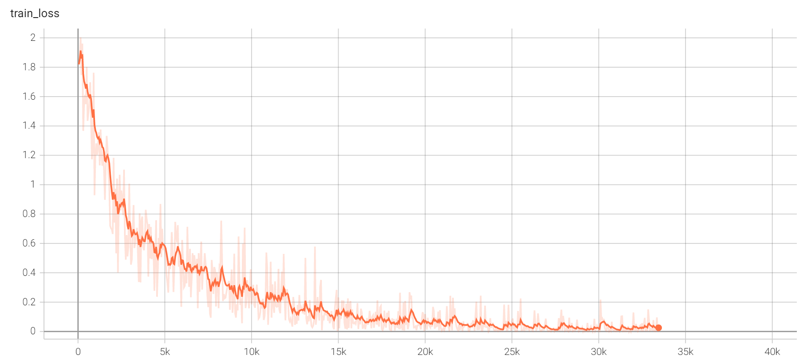
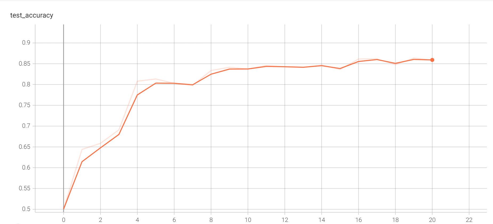
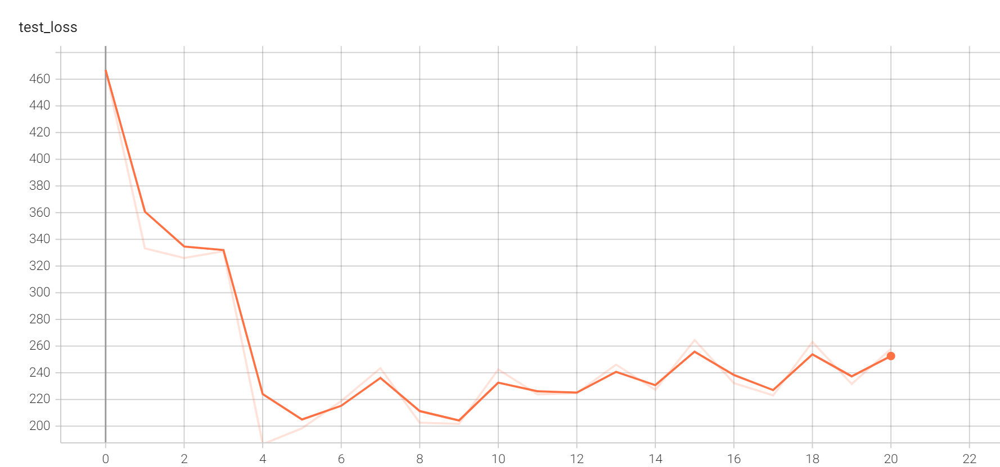

# A image classification project Based on VGG16 Deep learning neural Network

This is a simple image classification project VGG16 Deep learning neural Network.

## About images we need to apply segmentation:

The image data set I used is the pytorch built-in CIFAR10 dataset. It contains 50000 (training set) + 10000 (testing set) images with 10 classes.

## training and testing:
The train.py will build a new VGG16 model and load and train all images in the "data" folder. During the training, it will print and write the train loss and accuracy based on testing set to the tensorboard after a certain amount of images are trained. It also save the model in pt format in the "saved_model" folder. 

## Results:
These results are generated after the model is trained after 30 epochs.

Train_loss:

Accuracy based on testing set:

The maximum accuracy reached 86.17%

Testing loss based on testing set:

